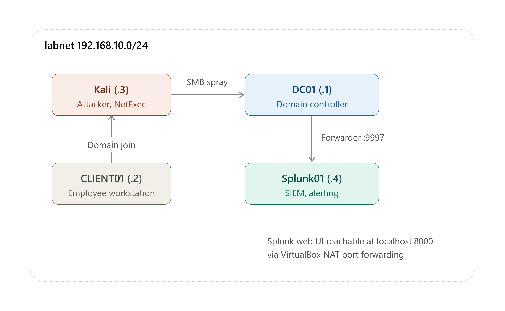
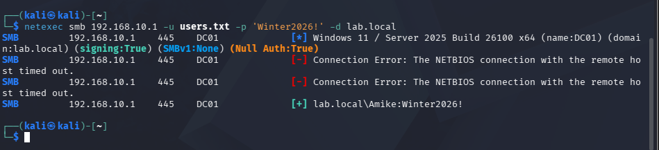
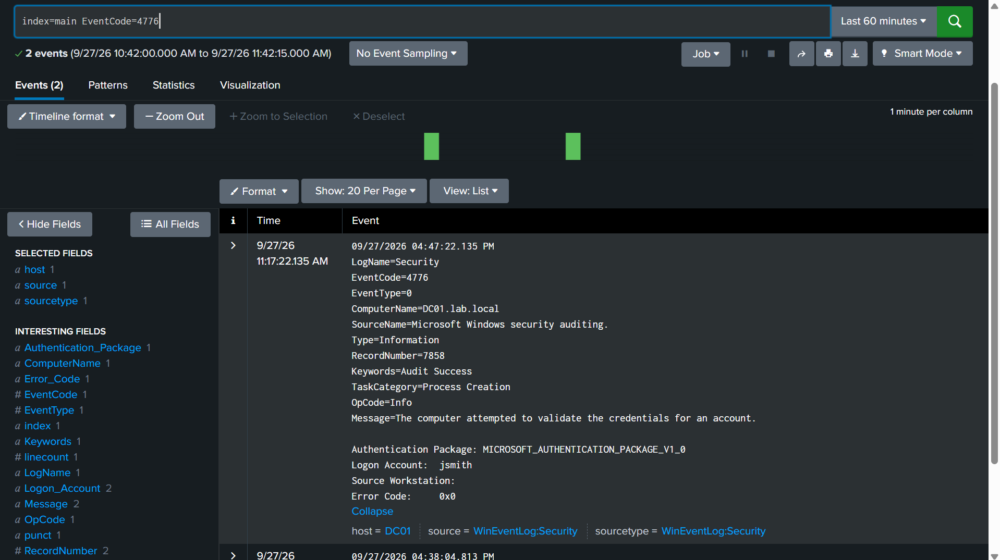
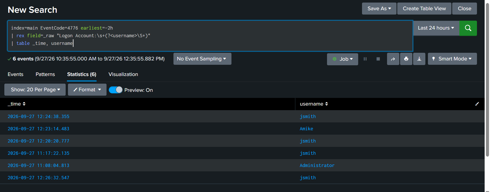
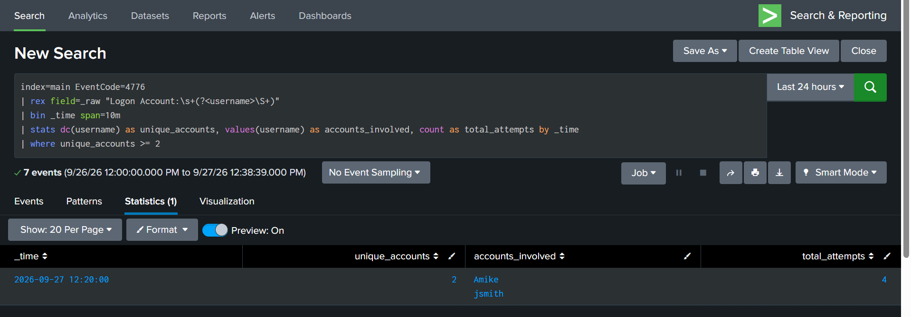
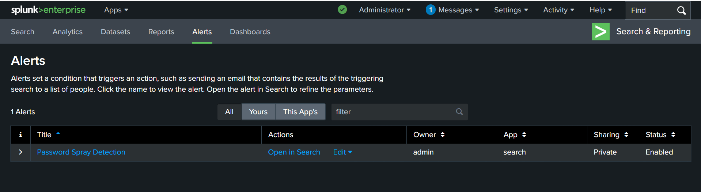
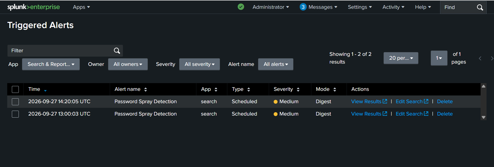

# Home SOC Lab — Detecting a Password Spray Attack with Splunk

A self-built home lab simulating a small company network, used to detect a simulated password-spray attack in real time using Splunk.

I built this project to practice detection engineering hands-on: standing up a Windows domain, forwarding its security logs into a SIEM, simulating a realistic attack, and writing a detection rule that correctly identifies it — including finding and fixing a bug in my own detection logic.

## Architecture

[](screenshots/00-architecture-diagram.png)

| Machine | Role | IP |
|---|---|---|
| DC01 | Windows Server 2025 — Domain Controller | 192.168.10.1 |
| CLIENT01 | Windows 10 — domain-joined employee workstation | 192.168.10.2 |
| Kali | Attacker machine (NetExec) | 192.168.10.3 |
| Splunk01 | Ubuntu Server — Splunk Enterprise SIEM | 192.168.10.4 |

All four machines run in an isolated internal network (`labnet`), separate from the internet.

## What I Built

- Stood up a Windows domain (`lab.local`) with a Domain Controller and three user accounts
- Joined a Windows 10 workstation to the domain
- Installed Splunk Enterprise as a SIEM and configured it to receive logs
- Installed a Splunk Universal Forwarder on the Domain Controller to ship Windows Security logs to Splunk in real time
- Enabled detailed logon auditing (`auditpol`) so authentication attempts are actually recorded
- Simulated a password-spray attack from Kali Linux using NetExec
- Wrote and validated a Splunk detection search that flags the attack pattern
- Turned the detection search into a live, scheduled alert

## The Attack

Using [NetExec](https://github.com/Pennyw0rth/NetExec) (a SMB-based credential attack tool), I ran a password spray against the domain controller — trying candidate passwords across multiple usernames at once, the way a real attacker would when they know employee usernames but not passwords:

```
netexec smb 192.168.10.1 -u users.txt -p 'Winter2026!' -d lab.local
```

[](screenshots/02-attack-netexec.png)

Multiple spray attempts were run with different candidate passwords, simulating an attacker trying several common passwords rather than one.

### Key discovery: the right event code

I initially expected these logon attempts to appear as EventCode 4625 (failed interactive logon) or 4624 (successful interactive logon). They didn't. NetExec authenticates over SMB/NTLM, which Windows logs under **EventCode 4776 (Credential Validation)** instead — a detail I only found by digging through the raw logs when the events I expected weren't there.

[](screenshots/01-raw-log-4776.png)

Splunk didn't automatically extract the username from these events, so I wrote a field extraction to pull it out of the raw text:

```spl
rex field=_raw "Logon Account:\s+(?<username>\S+)"
```

Once extracted, I could see a clear timeline of every credential validation attempt, across two real accounts, clustered tightly in time — the signature of a spray, not normal user activity:

[](screenshots/03-logon-timeline.png)

## Detection Logic

A single failed or successful login means nothing on its own. What makes a spray identifiable is the **pattern**: several different accounts, authenticated in a short window, faster than normal human behavior. That's what this search looks for:

```spl
index=main EventCode=4776 earliest=-10m
| rex field=_raw "Logon Account:\s+(?<username>\S+)"
| bin _time span=10m
| stats dc(username) as unique_accounts, values(username) as accounts_involved, count as total_attempts by _time
| where unique_accounts >= 2
```

This groups credential-validation events into 10-minute windows and flags any window where **2 or more distinct accounts** were targeted — the core signal of a spray attack versus normal, isolated logins.

[](screenshots/04-detection-search.png)

The search correctly identified the attack window, showing 2 unique accounts (`Amike`, `jsmith`) and 4 total authentication attempts.

## The Alert

I saved this search as a scheduled Splunk alert, **"Password Spray Detection"**, running automatically every 10 minutes via cron (`*/10 * * * *`) — no manual searching required.

[](screenshots/05-alert-config.png)

After running a fresh attack, the alert fired on its own and appeared under Splunk's Triggered Alerts, with no action needed from me to "discover" it:

[](screenshots/06-triggered-alerts.png)

## Challenges & Lessons Learned

**1. The event code wasn't what I expected.**
I assumed failed logins would show up as EventCode 4625. They didn't, because NetExec uses SMB/NTLM authentication, which Windows logs differently (4776). This taught me that detection engineering requires verifying assumptions against real data, not just documentation.

**2. My first alert version had a false-positive bug.**
My initial detection search had no time boundary, so every time it ran, it re-scanned the *entire* log history — meaning old attacks kept re-triggering the alert over and over, long after the attack ended. I fixed this by adding `earliest=-10m` to the search, so it only evaluates recent events matching the alert's own schedule. This is a real-world SIEM tuning problem — a badly-scoped detection rule creates alert fatigue, which is one of the most common (and dangerous) problems in real SOCs.

**3. Password spraying vs. brute forcing.**
This project specifically simulates a *spray* (one password tried across many accounts) rather than a brute force (many passwords tried against one account) — spraying is the more realistic technique for attackers who don't know any single account's password but want to avoid triggering account lockouts.

## Skills Demonstrated

- Active Directory Domain Services setup and administration
- Windows Security auditing and event log analysis
- Splunk SIEM deployment, log forwarding architecture (Universal Forwarder, receiving ports)
- SPL (Search Processing Language) — field extraction (`rex`), time bucketing (`bin`), aggregation (`stats`)
- Detection engineering: building and validating an alert against real attack data
- Identifying and fixing a false-positive/alert-fatigue issue in a live detection rule
- Basic offensive tooling (NetExec) to generate realistic attack telemetry
- Linux server administration (Ubuntu, netplan networking)
- VirtualBox lab networking (isolated internal network, NAT port forwarding)

## Tools Used

Windows Server 2025 · Windows 10 · Kali Linux · Splunk Enterprise 9.4.2 · Splunk Universal Forwarder · NetExec · VirtualBox
